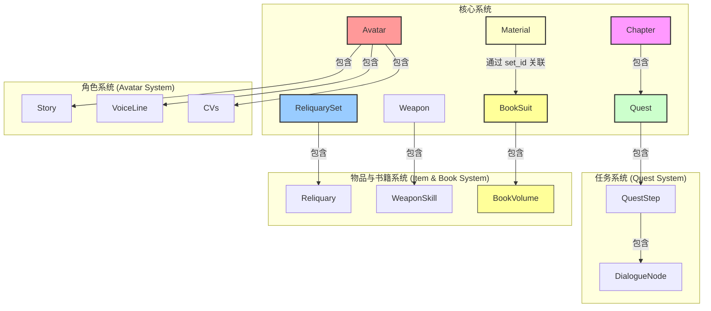

# Game Data Parser - 数据模型文档

本文档旨在详细说明 `game_data_parser` 项目中定义的核心数据模型 (`models.py`)。所有开发工作都应以本文档作为数据结构的事实来源。

## 核心原则

1.  **文档是事实的反映**: 本文档严格基于 `models.py` 中的定义编写，旨在客观描述数据结构。
2.  **警惕 Null 与空值**: 在消费数据时，必须对 `Optional` 类型、空字符串 `""` 或空列表 `[]` 进行健壮性检查，不能假设字段一定有符合预期的值。

---

## 模型总览

---

## 1. 任务系统模型

### 1.1 Chapter (章节)
代表一个章节的元数据。

| 字段名 | 类型 | 字段说明 |
| :--- | :--- | :--- |
| `id` | `int` | 章节的唯一ID。 |
| `title` | `str` | 章节标题。 |
| `entry_quest_ids` | `List[int]` | 章节的入口任务ID列表。 |
| `quest_type` | `Optional[str]` | 任务类型 (如 "AQ", "WQ")。 |
| `city_id` | `Optional[int]` | 所属城市ID。 |
| `group_id` | `Optional[int]` | 分组ID。 |
| `required_player_level` | `Optional[int]` | 需求玩家等级。 |
| `required_activity_id` | `Optional[int]` | 需求活动ID。 |
| `chapter_num_text` | `Optional[str]` | 章节的数字文本 (如 "第二章 第一幕")。 |
| `image_title` | `Optional[str]` | 图片标题。 |
| `quests` | `List[Quest]` | 包含的 `Quest` 对象列表。 |

> **注意**: `QuestInterpreter` 会动态创建两种特殊的章节：
> - **ORPHAN_SERIES**: 用于收纳有 `series_id` 但不属于任何现有章节的“系列孤立任务”。
> - **ORPHAN_MISC**: 用于收纳没有 `series_id` 的“零散孤立任务”。

### 1.2 Quest (任务)
代表一个完整的、可接取的任务。

| 字段名 | 类型 | 字段说明 |
| :--- | :--- | :--- |
| `quest_id` | `int` | 任务的唯一ID。 |
| `quest_title` | `str` | 任务的官方标题。 |
| `quest_description` | `str` | 任务的描述文本。 |
| `chapter_id` | `int` | 所属章节ID。 |
| `chapter_title` | `str` | 所属章节的标题。 |
| `series_id` | `int` | 所属系列ID。 |
| `chapter_num` | `Optional[str]` | 章节编号。 |
| `quest_type` | `Optional[str]` | 任务类型。 |
| `steps` | `List[QuestStep]` | 包含的 `QuestStep` 对象列表。 |
| `suggest_track_main_quest_list` | `Optional[List[int]]` | 建议追踪的主线任务列表。 |
| `source_json` | `Optional[str]` | 原始数据源JSON文件名。 |

### 1.3 QuestStep (子任务/步骤)
代表一个任务中的具体步骤或子任务。

| 字段名 | 类型 | 字段说明 |
| :--- | :--- | :--- |
| `step_id` | `int` | 子任务ID, 对应原始 `subId`。 |
| `title` | `Optional[str]` | 子任务的标题。 |
| `step_description` | `Optional[str]` | 子任务的描述。 |
| `dialogue_nodes` | `List[DialogueNode]` | 对话节点树的根节点列表。 |
| `talk_ids` | `List[int]` | 触发对话的ID列表。 |

### 1.4 DialogueNode (对话节点)
对话树的基本构成单元。

| 字段名 | 类型 | 字段说明 |
| :--- | :--- | :--- |
| `speaker` | `str` | 发言人姓名。 |
| `content` | `str` | 对话内容。 |
| `node_type` | `Literal["dialogue", "option", "narratage"]` | 节点类型: "dialogue" (对话), "option" (选项), "narratage" (旁白)。 |
| `id` | `Optional[int]` | 对话节点的ID。 |
| `options` | `List[DialogueNode]` | 当 `node_type` 为 "option" 时，存储玩家选项。 |

---

## 2. 物品系统模型

### 2.1 ReliquarySet (圣遗物套装)

| 字段名 | 类型 | 字段说明 |
| :--- | :--- | :--- |
| `id` | `int` | 套装ID。 |
| `name` | `str` | 套装名称。 |
| `effect_2_piece` | `Optional[str]` | 2件套效果。 |
| `effect_4_piece` | `Optional[str]` | 4件套效果。 |
| `reliquaries` | `List[Reliquary]` | 包含的 `Reliquary` 部件对象列表。 |

#### 2.1.1 Reliquary (圣遗物部件)

| 字段名 | 类型 | 字段说明 |
| :--- | :--- | :--- |
| `id` | `int` | 部件ID。 |
| `name` | `str` | 部件名称。 |
| `description` | `str` | 部件描述。 |
| `story` | `str` | 部件故事。 |
| `set_id` | `int` | 所属套装ID。 |
| `set_name` | `str` | 所属套装名称。 |
| `pos_name` | `str` | 部位名称 (如 "生之花")。 |
| `pos_index` | `int` | 部位索引 (1-5)。 |

### 2.2 Weapon (武器)

| 字段名 | 类型 | 字段说明 |
| :--- | :--- | :--- |
| `id` | `int` | 武器ID。 |
| `name` | `str` | 武器名称。 |
| `description` | `str` | 武器描述。 |
| `story` | `str` | 武器故事。 |
| `type_name` | `str` | 武器类型 (如 "单手剑")。 |
| `rank_level` | `int` | 星级。 |
| `skill` | `Optional[WeaponSkill]` | 嵌套的武器技能对象。 |

#### 2.2.1 WeaponSkill (武器技能)

| 字段名 | 类型 | 字段说明 |
| :--- | :--- | :--- |
| `name` | `str` | 技能名称。 |
| `descriptions`| `List[str]` | 包含5个精炼等级描述的列表。 |

### 2.3 Material (道具/材料)

| 字段名 | 类型 | 字段说明 |
| :--- | :--- | :--- |
| `id` | `int` | 材料ID。 |
| `name` | `str` | 材料名称。 |
| `description` | `str` | 材料描述。 |
| `material_type_raw`| `str` | 原始材料类型 (如 "MATERIAL_AVATAR_MATERIAL")。 |
| `type_name` | `str` | 二级分类名称 (如 "角色培养素材")。 |
| `story` | `Optional[str]` | 材料故事 (主要用于风之翼等特殊物品)。 |
| `is_book` | `bool` | 标记该道具是否为一本书籍。 |
| `codex_id` | `Optional[int]` | 如果是书籍，此为对应的图鉴ID。 |
| `set_id` | `Optional[int]` | 如果是书籍，此为关联到的 `BookSuit` (书籍系列) ID。 |

---

## 3. 角色系统模型

### 3.1 Avatar (角色)

| 字段名 | 类型 | 字段说明 |
| :--- | :--- | :--- |
| `id` | `int` | 角色ID。 |
| `name` | `str` | 角色名称。 |
| `description` | `str` | 角色描述。 |
| `title` | `Optional[str]` | 称号。 |
| `birthday` | `Optional[str]` | 生日 (格式 "月-日")。 |
| `constellation`| `Optional[str]` | 命之座。 |
| `nation` | `Optional[str]` | 所属国家/地区。 |
| `vision` | `Optional[str]` | 神之眼 (元素属性)。 |
| `cvs` | `CVs` | 嵌套的 `CVs` 声优信息对象。 |
| `stories` | `List[Story]` | 角色故事列表。 |
| `voice_lines`| `List[VoiceLine]`| 角色语音列表。 |
| `skill_depot_id`|`Optional[int]`| 技能库ID。 |

### 3.2 CVs (声优)

| 字段名 | 类型 | 字段说明 |
| :--- | :--- | :--- |
| `chinese` | `Optional[str]` | 中文配音演员。 |
| `japanese` | `Optional[str]` | 日文配音演员。 |
| `english` | `Optional[str]` | 英文配音演员。 |
| `korean` | `Optional[str]` | 韩文配音演员。 |

### 3.3 Story (角色故事)

| 字段名 | 类型 | 字段说明 |
| :--- | :--- | :--- |
| `title` | `str` | 故事标题。 |
| `text` | `str` | 故事内容。 |

### 3.4 VoiceLine (角色语音)

| 字段名 | 类型 | 字段说明 |
| :--- | :--- | :--- |
| `title` | `str` | 语音标题。 |
| `text` | `str` | 语音文本。 |

---

## 4. 书籍系统模型

### 4.1 BookSuit (书籍系列)
代表一个书籍系列，如一部小说集。

| 字段名 | 类型 | 字段说明 |
| :--- | :--- | :--- |
| `id` | `int` | 书籍系列ID。 |
| `name` | `str` | 书籍系列名称。 |
| `volumes` | `List[BookVolume]` | 包含的 `BookVolume` (分卷) 对象列表。 |

### 4.2 BookVolume (书籍分卷)
代表书籍系列中的一个分卷。

| 字段名 | 类型 | 字段说明 |
| :--- | :--- | :--- |
| `volume_title`| `str` | 分卷标题。 |
| `introduction`| `str` | 分卷介绍。 |
| `book_txt_id` | `int` | 用于加载分卷内容的ID。 |

> **注意**: 分卷的具体内容是 **懒加载** 的。当消费端首次需要内容时，才会通过此ID从文件中读取。